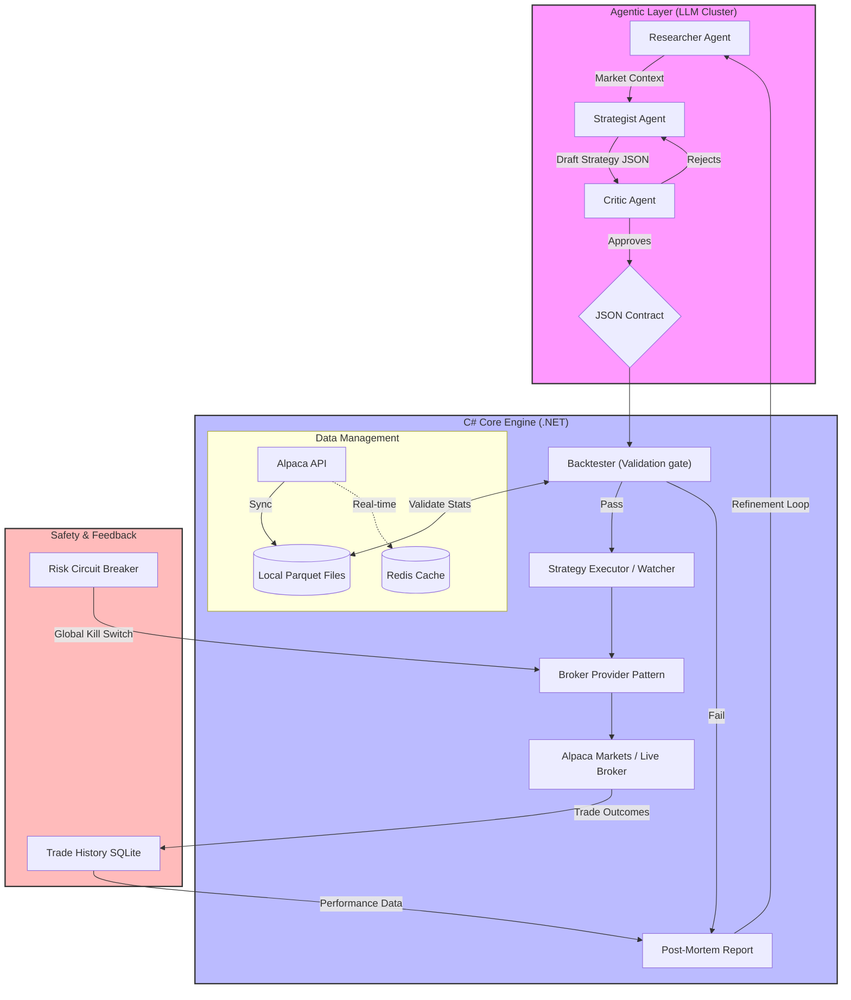

### Questions to consider:
- **The "Overfitting" Trap:** If the Agentic Cluster is allowed to iterate indefinitely until it passes the backtest threshold, it will simply find a strategy that overfits the recent historical data but fails in the live market. How will you ensure the agents aren't just "gaming" the backtester?
- **Risk of Infinite Loop:** If the Critic Agent always rejects the Strategist, your bot will never trade. What is the tie-breaking logic?
- **The "Trader Agnostic" Goal:** You mentioned you want this to work for humans too. If a human submits a trade, do you still want the engine to force a backtest? A human might trade on "gut feel" or news that hasn't happened yet—data the backtester doesn't have. How will the engine handle "Manual Overrides"?
- **Strategy vs. Signal:** Is the AI providing a **Signal** (Buy BTC now) or a **Strategy** (Buy BTC when RSI < 30)? If it's a Strategy, your Engine needs a "Strategy Executor" that is constantly watching the ticker to trigger the entry. This adds significant complexity to your C# Core.
- **The Data Schema:** How do you plan to define a "Strategy" in a way that is flexible enough for an AI to be creative, but rigid enough for a C# engine to execute without crashing?
- **Backtesting Frequency:** If the Agentic Cluster generates 100 variations of a strategy, do you intend to run 100 backtests? C# is fast, but hitting the Alpaca Historical Data API 100 times in a row might get you rate-limited. You'll need to cache that data locally.
- **The "Black Box" Problem:** If the engine executes a trade and it goes south, how will the AI "learn"? Will you have a pipeline to feed the **loss results** back into the Cluster to update their instructions?
- **Concurrency:** If the Agentic Cluster sends 5 different "Buy" signals for different stocks at the same time, but you only have enough buying power for 2, how does the Engine decide which to pick? Does it pick the first one, or the one with the highest "Agent Confidence" score?
- **Indicator Drift:** Since you are using C#, will you write your own Technical Analysis (TA) library, or use something like `Skender.Stock.Indicators`? It is vital that the Agent, the Backtester, and the Engine all agree on what "RSI 30" actually means.

### High Level Overview

The system is divided into two primary domains to separate "Thinking" from "Doing."
- **The Agentic Layer:** A multi-agent cluster (Researcher, Strategist, Critic) that iterates on strategies. It outputs a structured JSON contract rather than raw text.
- **The Trading Engine:** A deterministic C# service that acts as the gatekeeper. It validates agent proposals via backtesting before allowing them to touch the broker API.

### Backend Overview

#### Technology Stack

| **Component**        | **Technology**                      | **Reasoning**                                                                                       |
| -------------------- | ----------------------------------- | --------------------------------------------------------------------------------------------------- |
| **Primary Language** | **C# / .NET**                       | High performance, excellent async support, and shares models across all modules.                    |
| **Broker API**       | **Alpaca Markets**                  | Robust API, supports both paper and live trading with a clean C# SDK.                               |
| **Data Storage**     | **Parquet files + SQLite/Postgres** | Parquet for high-speed historical bar reads; SQLite or Postgres for trade history and agent context |
| **Caching**          | **Redis**                           | For "hot" market data and inter-service state sharing.                                              |
| **Communication**    | **System.Threading.Channels**       | For high-performance, thread-safe internal messaging.                                               |
| **Environment**      | **Docker Compose**                  | Orchestrates the Engine, DB, Redis, and Agent services on Arch Linux/VPS.                           |

##### NuGet Packages

- [Skender.Stock.Indicators](https://github.com/DaveSkender/Stock.Indicators)

#### Core Engine Components & Decisions

##### A. The Validation Gate (Backtester)

- **Workflow:** The engine receives a strategy $\rightarrow$ runs an automated backtest against local Parquet data $\rightarrow$ compares results against a threshold (Sharpe Ratio, Max Drawdown) $\rightarrow$ accepts/rejects.    
- **Anti-Bias:** The backtester and live engine will share the same math libraries to prevent **Indicator Drift**.
    
##### B. Broker Agnosticism

- **Pattern:** Utilizing the **Strategy/Provider Pattern**. The engine interacts with an `IBroker` interface, making it trivial to swap Alpaca for Interactive Brokers or a Crypto Exchange later.

##### C. Strategy vs. Signal Execution

- **Signal:** Immediate market/limit execution.
- **Strategy:** The engine enters a "Watcher" state, monitoring real-time data for specific technical triggers (e.g., RSI crosses) before firing the order.

##### D. Data Management

- **Caching Strategy:** A multi-tier approach. Recent bars stay in Redis; historical bars are stored in local Parquet files to avoid Alpaca rate limits and minimize latency.

#### Operational & Risk Decisions

- **Admin Dashboard:** A simplified "Start/Stop" interface with a read-only view of positions. Manual trading is disabled in V1 to prevent state desynchronization.
- **Risk Circuit Breaker:** A standalone logic module that monitors total account equity and can "Kill All" positions if a global drawdown limit is hit.
- **The Feedback Loop:** Failed trades or rejected backtests generate a "Post-Mortem" report. This context is fed back to the Agentic Layer to refine its future strategies.

#### Key Engineering Challenges Identified

- **Idempotency:** Ensuring the C# math produces identical results in both backtesting and live environments.
- **Concurrency:** Using `SemaphoreSlim` and `Channels` to handle simultaneous backtesting and live market data processing without deadlocks.
- **Time-to-Live (TTL):** Implementing expiration for "Pending" strategies so the engine doesn't accumulate thousands of stale watchers.
- **Overfitting**: To prevent "gaming" the backtester, implement a *Walk-Forward Analysis*. The engine should split the historical data: use one segment for the agent's "optimization" and a completely hidden "out-of-sample" segment for the final validation gate.

#### Diagrams

