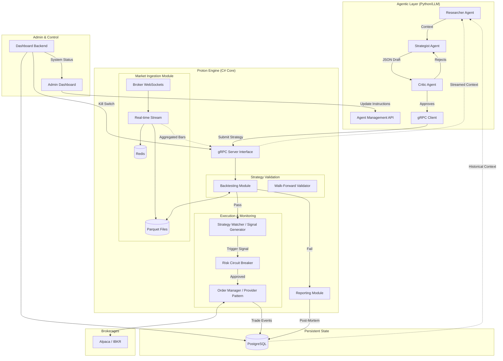

### Questions to consider:
- **The "Overfitting" Trap:** If the Agentic Cluster is allowed to iterate indefinitely until it passes the backtest threshold, it will simply find a strategy that overfits the recent historical data but fails in the live market. How will you ensure the agents aren't just "gaming" the backtester?
- **Risk of Infinite Loop:** If the Critic Agent always rejects the Strategist, your bot will never trade. What is the tie-breaking logic?
- **The "Trader Agnostic" Goal:** You mentioned you want this to work for humans too. If a human submits a trade, do you still want the engine to force a backtest? A human might trade on "gut feel" or news that hasn't happened yet—data the backtester doesn't have. How will the engine handle "Manual Overrides"?
- **Strategy vs. Signal:** Is the AI providing a **Signal** (Buy BTC now) or a **Strategy** (Buy BTC when RSI < 30)? If it's a Strategy, your Engine needs a "Strategy Executor" that is constantly watching the ticker to trigger the entry. This adds significant complexity to your C# Core.
- **The Data Schema:** How do you plan to define a "Strategy" in a way that is flexible enough for an AI to be creative, but rigid enough for a C# engine to execute without crashing?
- **Backtesting Frequency:** If the Agentic Cluster generates 100 variations of a strategy, do you intend to run 100 backtests? C# is fast, but hitting the Alpaca Historical Data API 100 times in a row might get you rate-limited. You'll need to cache that data locally.
- **The "Black Box" Problem:** If the engine executes a trade and it goes south, how will the AI "learn"? Will you have a pipeline to feed the **loss results** back into the Cluster to update their instructions?
- **Concurrency:** If the Agentic Cluster sends 5 different "Buy" signals for different stocks at the same time, but you only have enough buying power for 2, how does the Engine decide which to pick? Does it pick the first one, or the one with the highest "Agent Confidence" score?
- **Indicator Drift:** Since you are using C#, will you write your own Technical Analysis (TA) library, or use something like `Skender.Stock.Indicators`? It is vital that the Agent, the Backtester, and the Engine all agree on what "RSI 30" actually means.

### High Level Overview

The system is divided into two primary domains to separate "Thinking" from "Doing."
- **The Agentic Layer:** A multi-agent cluster (Researcher, Strategist, Critic) that iterates on strategies. It outputs a structured JSON contract via gRPC.
- **The Trading Engine:** A deterministic C# service acting as the "Source of Truth". It manages market ingestion, validates proposals via backtesting, and handles live execution.

### Backend Overview

#### Technology Stack

| **Component**        | **Technology**                      | **Reasoning**                                                                                       |
| -------------------- | ----------------------------------- | --------------------------------------------------------------------------------------------------- |
| **Primary Language** | **C# / .NET**                       | High performance, excellent async support, and shares models across all modules.                    |
| **Broker API**       | **Alpaca Markets**                  | Robust API, supports both paper and live trading with a clean C# SDK.                               |
| **Data Storage**     | **Parquet files + SQLite/Postgres** | Parquet for high-speed historical bar reads; SQLite or Postgres for trade history and agent context |
| **Caching**          | **Redis**                           | For "hot" market data and inter-service state sharing.                                              |
| **Communication**    | **System.Threading.Channels**       | For high-performance, thread-safe internal messaging.                                               |
| **Environment**      | **Docker Compose**                  | Orchestrates the Engine, DB, Redis, and Agent services on Arch Linux/VPS.                           |

##### NuGet Packages

- [Skender.Stock.Indicators](https://github.com/DaveSkender/Stock.Indicators)

#### Core Engine Components & Decisions

##### A. Market Ingestion Daemon

The Engine runs a background worker that maintains a persistent WebSocket connection to the broker.

- **Internal Distribution:** Uses System.Threading.Channels to broadcast data to the Backtester and Strategy Watchers.
- **External Streaming:** Acts as a gRPC Server, streaming aggregated OHLCV bars and indicators to the Agentic Layer.

##### B. The Validation Gate (Backtester)

The engine receives a strategy JSON via gRPC.

- **Workflow:** Runs an automated backtest against local Parquet data.
- **Anti-Bias:** Employs Walk-Forward Analysis (In-Sample vs. Out-of-Sample) to prevent the "Overfitting Trap".

##### C. The Trading Process (Watcher & Execution)

Once a strategy passes validation, it enters the live execution pipeline:

1. **Strategy Watcher:** A stateful object that monitors the live gRPC-fed market stream for specific technical triggers.
2. **Signal Generation:** When rules are met, a signal is sent to the Risk Module.
3. **Risk Circuit Breaker:** Validates global drawdown, position sizing, and account equity before allowing execution.
4. **Broker Provider:** Executes the order via the IBroker interface (Alpaca/IBKR).

#### Data Schema & Persistence

PostgreSQL serves as the unified storage layer for:

- **Trade History:** Entry/Exit prices, slippage, and fees.
- **Agent Context:** The "Thinking" (Chain-of-Thought) and JSON contracts associated with every trade.
- **Post-Mortem Reports:** Feedback generated after trades to inform future agent iterations.

#### Operational & Risk Decisions

- **Admin Dashboard:** A simplified "Start/Stop" interface with a read-only view of positions. Manual trading is disabled in V1 to prevent state desynchronization. Connects to Postgres for data visualization and the Agentic API for instruction updates.
- **Risk Circuit Breaker:** A high-priority gRPC command from the Dashboard that triggers the Risk Circuit Breaker to cancel all orders and halt watchers.
- **The Feedback Loop:** Failed trades or rejected backtests generate a "Post-Mortem" report. This context is fed back to the Agentic Layer to refine its future strategies.

#### Key Engineering Challenges Identified

- **Idempotency:** Ensuring the C# math produces identical results in both backtesting and live environments.
- **Concurrency:** Using `SemaphoreSlim` and `Channels` to handle simultaneous backtesting and live market data processing without deadlocks.
- **Time-to-Live (TTL):** Implementing expiration for "Pending" strategies so the engine doesn't accumulate thousands of stale watchers.
- **Overfitting**: To prevent "gaming" the backtester, implement a *Walk-Forward Analysis*. The engine should split the historical data: use one segment for the agent's "optimization" and a completely hidden "out-of-sample" segment for the final validation gate.

#### Diagrams

