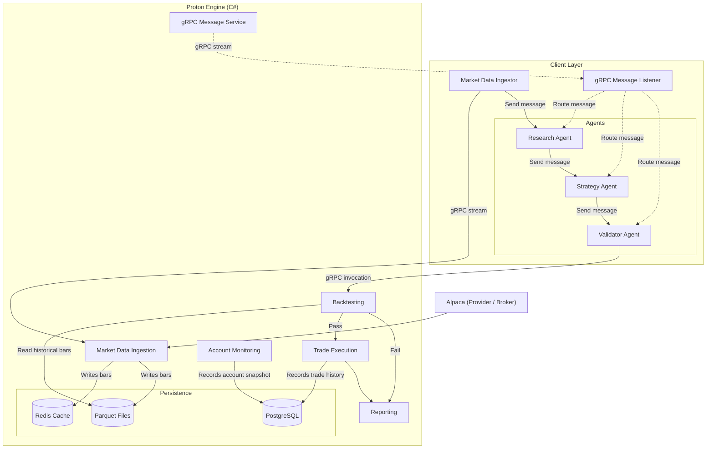

# Project Overview

This document aims to give a high level overview of the project's architecture, services and components. In this document, diagrams will be provided to paint a clearer picture for the reader and possibly an AI assistance.

## `Proton.Engine`

*Old documentation can be viewed [here](./engine/design_documentation.md).*

This engine will be responsible for market data ingestion, backtesting, technical analysis calculations, trade execution, logging/reporting, account management, and data persistence. `Proton.Core/` is the shared layer for interfaces/contracts, models, utilities, and thin services. `Proton.AppHost/` is the entry point to the application, which maintains a gRPC server.

### `Proton.AppHost`

The entry point to the engine. This is where service orchestration is implemented. Each module (service) will be registered in the process's lifecycle in `Program.cs`. Configuration files are set in `appsettings.json`, with the more sensitive keys reside in user-secrets. The gRPC endpoints are implemented under `Servers/Grpc`.

### `Proton.Backtesting`

This has yet to be completed, but I plan on using [this](https://mccaffers.com/quantitative_engineering/building_a_backtesting_system/) as a reference when building.

### `Proton.Core`

Shared repository for interfaces, models, and utilities. Majority of the modules in the engine reference this project.

### `Proton.Database.Parquet`

A concrete implementation of `IBarRepository`. The engine stores market data via Parquet files, which is a column-oriented data file. `Proton.Backtesting` will utilize these files for backtesting.

Most likely there'll be a time when this needs a rewrite. While the current implementation (a semaphore) protects the file from concurrent readers/writers, a bigger problem exists: switching to intraday granularity will cause this to fail.

### `Proton.Database.Redis`

A concrete implementation of `ICacheRepository`. The cache is supplied with data from Parquet files and market data.

### `Proton.Indicators`

Responsible for technical analysis calculations. Uses `Skender.Stock.Indicators` for calculations.

### `Proton.MarketDataIngestion`

Manages symbol subscriptions and digestion. Integrates with `Proton.Database.Parquet`, `Proton.Database.Redis`, and `Proton.Indicators` to persist and supply subscribers with market data alongside a technical analysis.

## `Proton.Agent`

This is currently still a WIP and has lots of moving parts that could later change. The idea is a Rust CLI that operates similar to coding agents such as Claude Code, Codex, Gemini CLI, etc. Naturally, this is the control center that connects to the engine. The user will be able to configure their agents (whether through a hosted provider or locally), monitor their account activity and portfolio, generate trade reports, and more. Having a few sub-agents dedicated for roles such as researcher, strategist, validator, etc. will have this project act as an orchestrator. It'll need to maintain opened gRPC streaming endpoints from the engine so that it can receive relevant contextual information.

## Diagrams

**High-level program architecture**:

